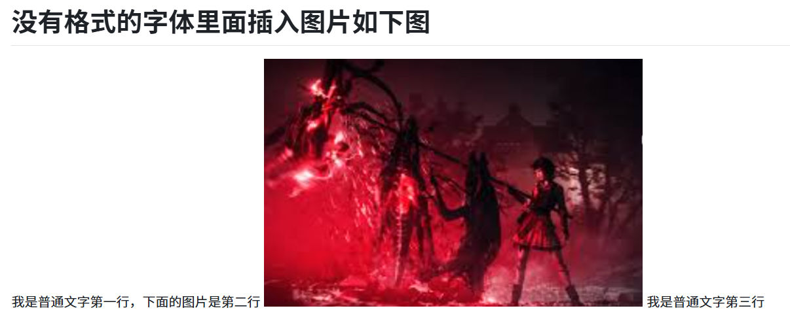

# 1个#号加空格是1级标签

## 2个#号+空格是二级标签
### 3个#号+空格是3级标签
#### 4个#号加空格是4级标签
最多可以到7级标签
## 有序列表
1. 数字后面一个点+空格就是有序列表
2. 数字后面一个点+空格就是有序列表
3. 数字后面一个点+空格就是有序列表
4. 数字后面一个点+空格就是有序列表
5. 数字后面一个点+空格就是有序列表
6. 数字后面一个点+空格就是有序列表
## 无序列表
- \-后面一个点+空格就是无序列表
- \-后面一个点+空格就是无序列表
- \-后面一个点+空格就是无序列表
- \-后面一个点+空格就是无序列表
- \-后面一个点+空格就是无序列表
## 3个\`号里面包裹的是代码

```python
print('hello word')

```

## \>号后面是引用内容
> 这是引用内容
> 这是引用内容
> 这是引用内容
> 这是引用内容


## 图片可以用截图工具截完图后再这里ctrl+v粘贴就可以了


## 有序列表里跟图片，会出现显示不完美的情况，如下所示
1. 这是一个有序列表下面根一个张图片
2. 
3. 我是有序列表2
4. 我是有序列表3
5. 如果图片不给它序列号在github上就会如下面显示，图片跑到最前面了
6. 
# 没有格式的字体里面插入图片如下图
我是普通文字第一行，下面的图片是第二行

我是普通文字第三行

# 如上面的图片，在普通文字行里插入图片本来图片是第二行，会跑到2行文字的中间来，如下图github里所示



# 接下来我在无序列表列插入图片
- 我是第一行无序列表
- 我是第二行无序列表，第3行时图片
- 
- 我是无序列表的四行
# 任务列表
-【】慷慨大方

## 变更内容
- [x] 功能A
- [ ] 修复Bug B

## 相关Issue
Fixes #123

## 测试
- [ ] 通过现有测试
- [ ] 添加新测试
- [ ] 多看看发的
这是一个不错的选择，我一会给你配合，明天发货，天到家


