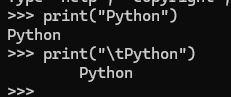

# 变量命名规则
1. 变量名只能包含字母，数字和下划线。变量能以字母或下划线大头，但不能以数字大头。例如，可将变量命名为message_1,但是不能将其命名为1_message
2. 变量名不能包含空格，但能使用下划线来分割其中的单词。例如，变量名greeting_message可行，但是变量名greeting message会应发错误。
3. 不要将python关键字和函数名用作变量名。例如，不要将print用作变量名，应为它被python留作特殊用途
4. 变量名应即简短又具有描述性。例如，name比n好，student_name比s_n好，name_length比length_of_persons_name好。
5. 慎用小写字母l和大写字母O，因为它们可能被人看成1和0
## 变量是标签
变量常被描述为可用于存储值得盒子。在你刚接触变量时，这种定义很有帮助，但是他并没有准确的描述python内部表示变量的方式。一种好的多的定义是，变量是可以被赋值的标签，也可以说变量只指向特定的值。
## 字符串
就是一系列字符。在python中，用引号引起的都是字符串，其中的引号可以是单引号，也可以是双引号。
## 在字符串中使用变量
要在字符串中插入变量的值，可先在左引号前面加上f ,再将要插入的变量放在花括号内。这样，python在显示字符串时，将把每个变量都替换为其值。
```
firt_name = "zhangshan"

last_name = "lishi"

full_name = f"{firt_name} {last_name}"

print(full_name)
```
1. 可以使用title()方法来将姓名设置为合适的格式，首字母大写。如下
```
print(f"Hello,{full_name.title()}")
```
2. 还可以使用f字符串来创建消息，在把整条消息赋值给变量。
```
message = f"hello, {full_name.title()}"
print(message)
```
3. \t 使用制表符和换行符来添加空白

4. \n换行符的使用

