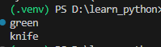
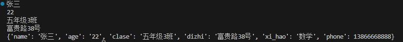
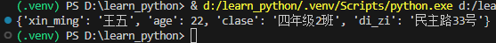
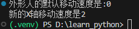
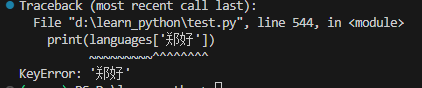

>理解字典后，你就能够更准确地为各种真实物体建模。你可以创建一个表达人的字典，然后在其中存储你想要的任何信息：姓名、年龄、地址、以及可以描述这个人的任何其他信息。你还能够在字典中存储任意两种相关的信息，如一系列单词及其含义、一系列人名及其喜欢的数、一系列山脉及其海拔等。

## 一个简单的字典
```python
dish = {'color':'green','name':'knife'}
print(dish['color'])
print(dish['name'])
```
- 字典dish存储了颜色和名称。最后两行代码访问字典并显示信息，结果如下
- 
- 与大多数编程概念一样，要熟悉的使用字典，需要一段时间的练习。使用字典一段时间后，你就会明白它们为何能够高效的模拟现实中的情形。
## 使用字典
>在Python中，字典是一系列健值对。每个健值都与一个值相关联，可以使用健来访问与之关联的值。与健相关联的值可以是数、字符串、列表乃至字典。事实上，可将任意python对象用作字典中的值。
>在Python中，字典用放在花括号{}中的一系列健值对表示，如前面的示例

- 健值对包含两个相互关联的值。当你指定健时，Python将返回与之相关联的值。健和值之间用冒号分隔，而键值对之间用逗号分隔。在字典中，你想存储多少个键值对都可以。
- 最简单的字典只有一个键值对。如下所示
```python
dish = {'name':"knife"}

```
- 这个字典中存储了一项有关dish的信息，具体的说‘name’是一个健，与之关联的值是“knife"。
## 访问字典中的值
```python
dish = {'name':'knife}
print(dish['name'])

```
- 这将返回字典dish中与健‘name’相关联的值“knife”

下面是一个学生的信息，读取存储在字典里的信息。
```python
names = {'name':'张三','age':'22','clase':'五年级3班','dizhi':'富贵路38号'}
print(names['name'])
print(names['age'])
print(names['clase'])
print(names['dizhi'])

```
### 添加健值对
>字典是一种动态结构，可随时在其中添加键值对。要添加键值对，可依次指定字典名，用方括号括起来的健和与该健关联的值。
>下面我们在学生的字典里添加两项信息：喜好、电话号码。如下示例

```python
names = {'name':'张三','age':'22','clase':'五年级3班','dizhi':'富贵路38号'}
print(names['name'])
print(names['age'])
print(names['clase'])
print(names['dizhi'])

names['xi_hao'] = '数学'
names['phone'] = 13866668888
print(names)

```
- 运行程序结果如下
- 
### 从创建一个空字典开始
>有时候，在空字典里中添加健值对很方便，甚至是必须的。为此，可先使用一对花括号定义一个空字典，在分行添加各个键值对。例如，下面的代码。

```python
names = {}
names['xin_ming'] = '王五'
names['age'] = 22
names['clase'] = '四年级2班'
names['di_zi'] = '民主路33号'

print(names)
```
执行结果如下：
- 
- 下面来看一个更有趣的例子：对一个能够以不同速度移动的外星人进行位置的跟踪。我们可以判断外星人的当前速度，并据此确定该外星人应该向右移动多远：
```python
alien_0 = {'x':0,'y':25,'speed':'medium'}
print(f"外星人的默认速度是：{alien_0['x']}")
if alien_0['speed'] == 'slow':
    #默认为漫速度,移动为1
    x_value = 1
elif alien_0['speed'] == 'medium':
    #这是为外星人的中等速度
    x_value = 2
else:
    #这时为外星人的最快速度
    x_value = 3
alien_0['x'] = alien_0['x'] + x_value

print(f"新的X轴移动速度是{alien_0['x']}")

```
- 代码讲解
- 首先定义一个外星人，其中包含初始的X坐标和Y 坐标，还有速度‘medium’。出于简化考虑，这里省略了颜色和分数，但即便包含这些键值对，这个示例的工作原理也不会有任何变化。我们还打印了"x"的初始值，旨在让用户知道这个外星人向右移动了多远。
- 使用if-elif-else语句来确定外星人应该向右移动多远，并将这个值赋给变量 “x“，如果外星人的速度是'slow',它将向右移动1个单位；如果速度为‘medium',将向右移动2个单位；如果速度更快，将向右移动3个单位。确定移动量后，将其x的当前值相加，在将结果关联到字典中的健x
- 因为这是一个速度中等的外星人，所以其位置将向右移动2个单位：如下
- 
- 这种技巧很棒：通过修改外星人字典中的值，可改变外星人的行为。例如，要将这个速度中等的外星人变成速度很快的外星人，可添加如下代码：
```python
alien_0['speed'] = 'fast'
```
- 这样，再次运行这些代码，if-elif-else语句将把一个更大的值赋给变量x
### 删除键值对

>对于字典中不在需要的信息，可使用***del***语句将相应的键值对彻底删除。在使用***del***语句时，必须指定字典名和要删除的健。
- 例如，下面的代码从字典names中删除健“phone”:
```python
names = {'name':'王五','age':23,'class':'一年级2班','phone':18677778888}
print(names)
del names['phone']
print(names)

```
del语句让python将健‘phone’从字典names中删除，同时删除与这个健关联的值。输出表明健“phone”及其值已被从字典中删除，但其键值对未受影响。
***注意：删除的键值对永远消失了***
## 由类似的对象组成的字典
>在前面的示例中，字典存储的是一个对象的多种信息，但也可以使用字典来存储多个对象的同一种信息。例如，你要调查很多人，询问他们喜欢什么编程语言，可使用一个字典来存储这种简单的调查结果。如下所示

```python
languages = {

    '张三':'php',

    '李四':'python',

    '王五':'javascript',

    '赵六':'rust',

    '徐墨':'java',

}

print(languages)

```
***注意***：对于较长的列表和字典，大多数编辑器提供了类似方式设置格式的功能。对于较长的字典，还有其他一些可行的格式设置方式，因为在你的编辑器或其他源代码中，你可能会看到稍微不同的格式设置方式。
### 使用get()来访问值
>使用放在方括号内的健从字典中获取感兴趣的值，可能会引发问题：如果指定的健步存在，将会出错。

如下，如果我们获取一个同学的"郑好"的健值
```python
languages = {
    '张三':'c',

    '李四':'python',

    '王五':'javascript',

    '赵六':'rust',

    '徐墨':'java',

}

print(languages['郑好'])

```

- 这时就会报错，如下
- 
- 就字典而言，为避免出现这样的错误，可使用get()方法在指定的健不存在时返回一个默认值。get()方法的第一个参数用于指定健，是必不可少的；第二个参数为指定的健不存在时要返回的值，是可选的：
```python

```