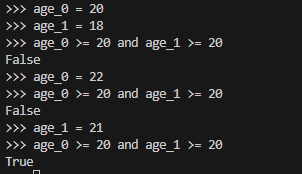
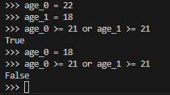

# for循环的使用
```python
caidan = ['红烧肉','小鸡炖蘑菇','素炒牛肉','辣根雨皮','炖排骨','红烧牛楠','土豆丝','拍黄瓜','遛虾仁']

for cd in caidan:
    #这是一个简单的for循环读取列表列的元素
    print(f"这道菜是:{cd}")
```
首先，我们定义一个菜单的列表。接下来，定义一个for循环。这行代码让python从列表caidan中取出一个菜单名字，并将其与变量cd相关联。最后，让python打印前面赋给变量cd的菜单名字。这样，对于列表中的每菜单名字。python都将重复执行最后的两行代码。
## 不必要的的缩进
1. 如果你不小心缩进了无须缩进的代码行，python将指出这一点
2. 函数调用print()无序缩进，因为它并非循环的组成部分。因此python将指出这种错误
3. 为避免意外的缩进错误，请只缩进要缩进的代码。在前面编写的程序中，只有是在for循环中对每个元素执行的代码需要缩进。
## 循环后不必要的缩进
1. 如果你不小心缩进了应该在循环结束后执行的代码，这些代码将针对每个列表元素重复执行。在一下情况下，这可能导致python报告语法错误，但通常只会导致逻辑错误。
## 遗漏冒号
for语句的冒号告诉python，下一行是循环的第一行。
```python
caidan = ['红烧肉','小鸡炖蘑菇','素炒牛肉','辣根雨皮','炖排骨','红烧牛楠','土豆丝','拍黄瓜','遛虾仁']

for cd in caidan

    #这是一个简单的for循环读取列表列的元素

    print(f"这道菜是:{cd}")
```
- 如果不小心遗漏了冒号，将导致语法错误，因为python不知道你想干什么。
## 使用range()函数
python函数range()让你能够轻松的生成一系列的数。例如，可以像下面这样使用range()函数来打印一系列的数：
```python
for value in range(1,5):
    print(value)
```
在这个实例中，range()只打印数1-4，这是编程语言中常见的差一行的结果。range()函数让python从指定的第一个值开始数，并在到达指定的第二个值时停止，因此输出不包含第二个值
要打印数1-5，需要使用range(1,6)
使用range()时，如果输出不符合预期，请尝试将指定的值加1或减1.
- 使用range()函数时，也可以只指定一个参数，这样它将从0开始，例如，range(6)返回数0-5
## 使用range()创建数值列表可以使用list()方法
```python
number = list(range(1,6))
print(number)
```
1. 使用range()函数时，还可以使用步长。为此，可以给这个函数指定第三个参数，python将根据这个步长来生成数。
下面的代码打印1~10的偶数
这个示例中，range()函数从2 开始数，然后不断地加2，直到达到超过终值11。
因此输出如下
[2, 4, 6, 8, 10]
	 
```python
number = list(range(2,11,2))
print(number)
```
2. 使用range()函数几乎可以创建任意数值集合。例如，如何创建一个列表，其中包含10整数(1-10)的平方呢？在python中，用两个星号（* * ）表示乘方运算。下面的代码演示如何将前10个整数的平方加入一个列表：
```python
number = []
for value in range(1,11):
    square = value ** 2
    number.append(square)
print(number)

#输出结果是：[1, 4, 9, 16, 25, 36, 49, 64, 81, 100]
```
- 为了让代码简洁也可以用临时变量square,而是直接将计算得到的每个值追加刀列表末尾
```python
number = []
for value in range(1,11):
    number.append(value**2)
print(number)
这样写得到的结果和上面一样的，代码更简洁
```
3. 对数值列表执行简单的统计计算
- 有几个python函数可能帮助你处理数值列表。例如下面，可以轻松找出数值列表中的最大值，最小值和总和：
```python
number = [1,3,5,7,9,10,15,20,0]

print(f"数值列表中最小值是:{min(number)}")
print(f"数值列表中最大值时:{max(number)}")
print(f"数值列表中所有数的和是:{sum(number)}")
```
4. **列表推导式，就是一行写for循环
下面的例子是求1~10的平方数
```python
number = [value**2 for value in range(1,11)]
print(number)

#执行结果为：[1, 4, 9, 16, 25, 36, 49, 64, 81, 100]
```
要使用这种语法，首先指定一个描述性的列表名，如number。然后指定一个左右括号，并定义一个表达式，用于生成要存储到列表中的值。在这个示例中，表达式为value ** 2 ,它计算平方值。接下来，编写一个for循环，用于给表达式赋值，在加上右方括号。在这个示例中，for循环为
for value in range(1,11),它将值1~10提供给表达式value ** 2 ，请注意这里的for语句末尾没有冒号。
- 下面是几个列表推导式的示例。
```python
#得到从1~20的数值
number = [value for value in range(1,21)]
print(number)


#下面的示例得到1~1百万的数值，并用for循环打印出来
number = [value for value in range(1,1000001)]
for value in number:
    #读取列表中所有数值,并打印出来
    print(value)

#求number列表中的最大数值
print(f"列表中最小的数值是:{min(number)}")

#求number列表中最小数值
print(f"列表中最大的数值是:{max(number)}")
```
## 使用列表的一部分->切片
1. 切片
- 要创建切片，可以指定要使用的第一个元素和最后一个元素的索引。与range()函数一样，python在到达指定的第二个索引之前的元素时停止。要输出列表中的前三个元素，需要指定索引0和3，这样返回索引分别为0，1 和 2 的元素。
- 下面的示例返回列表中前三个元素(前三道菜)
```python
caidan = ['红烧肉','小鸡炖蘑菇','素炒牛肉','辣根鱼皮','炖排骨','红烧牛楠','土豆丝','拍黄瓜','遛虾仁']

#返回列表前3个元素
print(caidan[0:3])

  

#返回列表2-4的元素,由于列表的起始索引是从0开始的,第2个道菜就是从索引1开始的,起始索引指定为1,并将终止索引指定为4,得到3道菜.

print(caidan[1:4])

  
#如果没有指定第一个索引,python将自动从列表开头开始到第5个索引值,不包括第5个值.
print(caidan[:5])

  
#要让切片终止到列表末尾也可以这样,从索引2元素值切片到末尾

#无论类别有多长,这种写法都可以让你输出从特定位置到列表末尾的所有元素.

print(caidan[2:])

  
#这样写可以得到列表最后3个元素值

print(caidan[-3:])
```
```python

```
## 遍历切片
- 下面的示例遍历前三个列表元素
```python
caidan = ['红烧肉','小鸡炖蘑菇','素炒牛肉','辣根鱼皮','炖排骨','红烧牛楠','土豆丝','拍黄瓜','遛虾仁']

#得到前3道菜
for caidan in caidan[:3]:
    print(caidan)

  
#得到后3道菜
for caidan2 in caidan[-3:]:
    print(caidan2)
```
## 复制列表
要复制列表，可以创建一个包含整个列表的切片，方法是同时省略起始索引和终止索引（[ : ]）。
这让python创建一个起始于第一个元素，终止于最后一个元素的切片，即复制整个列表。
```python
my_caidan = ['红烧肉','小鸡炖蘑菇','素炒牛肉','辣根鱼皮','炖排骨','红烧牛楠','土豆丝','拍黄瓜','遛虾仁']

#复制我的菜单给friend_caidan
friend_caidan = my_caidan[:]

print(f"这是我朋友喜欢的菜单:{friend_caidan}")

#给我的菜单里加了一道菜“韭菜炒鸡蛋”
my_caidan.append('韭菜炒鸡蛋')
print(f"这是我喜欢的菜单:{my_caidan}")
```
## 下面这种复制列表是错误的
这里将my_caidan 赋值给friend_caidan，而不是将my_caidan的副本赋值给friend_caidan。这种语法实际上是让python将新变量friend_caidan关联到my_caidan相关联的列表，因此这两个变量指向同一个列表。有鉴于此，当我们将“苹果汁”添加到friend_caidan里，在我的my_caidan里也看到了“苹果汁”，同时还少了一道菜”土豆丝“
```python
my_caidan = ['红烧肉','小鸡炖蘑菇','素炒牛肉','辣根鱼皮','炖排骨','红烧牛楠','土豆丝','拍黄瓜','遛虾仁']

#这样写就不是复制列表，而是将my_caidan 赋值给friend_caidan
friend_caidan = my_caidan
  
#朋友的菜单里添加一个"苹果汁",结果，我的菜单里也多出来一个苹果汁
#删除一道菜"土豆丝"，结果我的菜单里也没有土豆丝了，说明这两个列表就是指向一个列表的
friend_caidan.append('苹果汁')
friend_caidan.remove("土豆丝")

#我的菜单里添加了一瓶"矿泉水"
my_caidan.append('矿泉水')

print(f"朋友的菜单是:{friend_caidan}")
print(f"我的菜单是:{my_caidan}")
```
## 元组
列表非常适合用于存储在程序运行期间可能变化的数据集。列表是可以修改的，这对于处理网站的用户列表或游戏中的角色列表至关重要。然而，你有时候需要创建一系列不可修改的元素，元组可以满足这种需求。python将不能修改的值称为 ***不可变的***，而不可变的列表称为元组（tuple)

- 定义元组
元组看起来很像列表，但使用圆括号而不是方括号来标识。定义元组后，就可以使用索引来访问其元素，就像访问列表元素一样的。
```python

_tuple = ('红烧肉','小鸡炖蘑菇','素炒牛肉','辣根鱼皮','炖排骨','红烧牛楠','土豆丝','拍黄瓜','遛虾仁')

#获取元组后三道菜
print(a_tuple[-3:])

#获取元组前三道菜
print(a_tuple[:3])

#修改0索引的元素值，这道菜为"东坡肘子"会出错,应为元组里的元素是不可以修改的
_tuple[0] = '东坡肘子'

#打印这个元组
print(a_tuple)

```
***注意***
严格的说，元组是由逗号标识的，圆括号只是让元组看起来更整洁，更清晰。如果你要定义只包含一个元组的元组，必须在这个元素后面加上逗号：my_t= (3,)
创建只包含一个元素的元组通常没有意义，但自动生成的元组有可能只有一个元素。

## 遍历元组中的所有值
像列表一样，也可以使用for循环来遍历元组中的所有值。
```python
_tuple = ('红烧肉','小鸡炖蘑菇','素炒牛肉','辣根鱼皮','炖排骨','红烧牛楠','土豆丝','拍黄瓜','遛虾仁')

for value in _tuple:
    print(value)
```

## 修改元组变量
虽然不能修改元组的元素，但可以给元组的变量赋值。例如，要修改矩形的尺寸
可从新定义整个元组：
```python
ju_xing = (200,100)
for value in ju_xing:
    print(f"没有修改前矩形的长宽尺寸:{value}")


ju_xing = (300,200)
for value in ju_xing:
    print(f"修改后矩形的尺寸:{value}")
    
```
**输出结果如下:**
- 没有修改前矩形的长宽尺寸:200
- 没有修改前矩形的长宽尺寸:100
- 修改后矩形的尺寸:300
- 修改后矩形的尺寸:200

# if 语句
如下面的代码遍历一个厨具（dish）的列表,并以首字母大写的方式打印“bowl"碗的名字，其他一的厨具以首字母大写的方式打印出来。
```python
#示例1
dish = ['knife','spoon','fork','plate','bowl','cup','pot','pan','cutting board','spatula','kattle']

for dish in dish:
    if dish == 'bowl':
        print(dish.upper())
    else:
        print(dish.title())

#示例2
dish = ['knife','spoon','fork','plate','bowl','cup','pot','pan','cutting board','spatula','kattle']

for dish in dish:
    if dish != 'bowl':
        print(dish.title())
    else:
        print(dish.upper())
  
#这两个示例执行的结果是一样的，但是，代码的逻辑不一样的。            
#结果如下：

Fork
Plate
BOWL
Cup
Pot
Pan
Cutting Board
Spatula
Kattle

```
这个示例中循环首先检查当前厨具名称是否为'bowl'。如果是，就以全部大写的方式打印出来，否则以首字母大写的方式打印出来。

## 条件测试

>每条if语句的核心都是一个值为True的表达式，这种表达式称为条件测试。Python根据条件测试的值是True还是False来决定是否执行if语句中的代码。如果条件测试的值为True，Python就执行紧跟在if语句后面的代码；如果为false，python就忽略这些代码。

## 检查是否相等
大多数条件测将一个变量的当前值与特定的值进行比较。最简单的条件测试检查变量的值是否与特定值相等：
```python
dish = 'spoon'
dish == 'spoon'
True
```

如上面的示例，第一行使用一个等号将将变量dish的值设为‘spoon',这种做法已经见过很多次了。接下来的一行用两个等号== 检查dish值是否为’spoon'.这个***相等运算符*** 在它两边的值相等时返回True,否则返回False。在这个示例中，两边的值相等，因此返回True。

如果dish的值不是spoon,上述条件测试将返回False:
```python
dish = 'spoon'
dish == 'bowl'
False
```

一个等号是陈述，于是第一行代码可解读为：将变量dish的值设置为‘spoon'。两个等号则是发问，于是第二行代码可解读为：变量dish的值是”spoon"吗？大多数编程语言使用等号的方式与这里的示例相同。
## 如何检查是否相等时忽略大小写
>在Python中检查是否相等时是区分大小写的。例如，两个大小写不同的值被视为不想等：

```python
dish = 'fork'
dish == 'Fork'
False
```
如果大小写很重要，这种行为有其优点。但如果大小写无关紧要，你只想检查变量的值，可先将变量的值转换为全小写，在进行比较：
```python
dish = 'knife'
dish.lower() == 'knife'
True
```
无论值“knife"大小写如何，上述条件测试将返回True，应为它不区分大小写。lower()方法不会修改存储在变量dish中的值，因此进行这样的比较不会影响原来的变量：
- 

首先，将字母大写的字符串‘PLATE'的值赋给变量dish。然后，获取变量dish的值并将其转换为全小写，在将结果与字符串“plate"进行比较。这两个字符串相同，因此python返回True。如上所示，lower()方法并没有影响存储在变量dish里的值。

网站采用类似的方式让用户输入的数据符合特定的格式。例如，网站可能使用类似的条件测试来确保用户名是独一无二的，而并非只是与另一个用户名的大小写不同：在用户提交新的用户名时，把它转换为全小写的，并与所有即有用户名的小写版本进行比较。执行这种检查，如果已经有用户名“lomi"(不管大小写如何)，则用户在提交用户名”lomi“时将遭到拒绝。
## 检查是否不等
要判断两个值是否不等，可使用***不等运算符***（!=）.下面使用一条if语句来演示如何使用不等运输符。我们将把厨具存储在一个dish的变量里，接着判断哪些是不要用到的工具
```python
dish = 'bowl'
if dish.lower() != 'bowl':
    print("这是我们要的厨具")
print("这里没有我们要的厨具")
```
编写的大多数条件表达式会检查两个值是否相等，但有时候检查两个值是否不等的效率更高。

## 数值的比较
- 条件语句包含各种数学比较，如小于、小于等于、大于、大于等于：
- 
- 每种数学比较都能成为if语句的一部分，从而让你能够直接检查你感兴趣的多个条件
## 检查多个条件
你也可以同时检查多个条件。例如，有时候需要再两个条件都为True时才执行相应的操作，而有时候只要求一个条件为True。在这些情况下，关键字and 和 or 可助你一臂之力。
1. 使用and 检查两个条件是否都为True,可使用关键字and将两个条件测试合二为一。如果每个条件测试都通过了，整个表达式就为True;如果至少一个条件测试没有通过，整个表达式就为False,
- 例如，要检查两个人是否都不小于21岁，可使用下面的条件测试：
- 
- 为了改善可读性，可将每个条件测试部分分别放在一对括号内，但并非必要这样做。如果使用括号，条件测试类似于下面这样：
```python
(age_0 >= 20) and (age_1 >= 22)
```
## 使用or 检查多个条件
- 关键字***or*** 也能够让你检查多个条件，但是要满足其中一个条件，就能通过整个条件测试。仅当所有条件测试都没有通过时，使用***or***的表达式才为False。
- 下面再次检查两个人年龄，但检查的条件是至少有一个人的年龄不小于21岁：

- 
- 同样，首先定义两个用于存储年龄的变量。由于对age_0的条件测试通过了，因此整个表达式结果为True。接下来，将age_0减小为18。在最后的条件测试中，两个条件测试都没有通过，因此整个表达式的结果为Falae。

## 检查特定的值是否在列表中
- 有时候，执行操作前必须检查列表是否包含特定的值。例如，在结束用户的注册过程之前，需要检查它提供的用户名是否已在用户名列表中：在地图程序中，需要检查用户提交的位置是否在已知位置的列表中。

- 要判断特定的值是否在列表中，可使用关键字***in***。下面看看你可能会为饭店的菜单编写的一些代码
```python
my_caidan = ['红烧肉','小鸡炖蘑菇','素炒牛肉','辣根鱼皮','炖排骨','红烧牛楠','土豆丝','拍黄瓜','遛虾仁']

print('炖排骨' in my_caidan)

#执行结果返回的是True
```
关键字***in***让python检查列表my_caidan是否包含“炖排骨”，这种技巧很有用，让你能够在创建一个列表后，轻松地检查是否包含特定的值。
- 也可以用关键字***and***同时也可以检测2个特定值
```python
my_caidan = ['红烧肉','小鸡炖蘑菇','素炒牛肉','辣根鱼皮','炖排骨','红烧牛楠','土豆丝','拍黄瓜','遛虾仁']

print(('炖排骨' and '芝麻丸') in my_caidan)

#执行结果为:False
#由于芝麻丸不在菜单里
```

- 也可以用关键字***or***来同时检查几个特定的值，如下
```python
my_caidan = ['红烧肉','小鸡炖蘑菇','素炒牛肉','辣根鱼皮','炖排骨','红烧牛楠','土豆丝','拍黄瓜','遛虾仁']

print(('炖排骨' or '芝麻丸' or '小黄鱼') in my_caidan)

#执行结果为：True
#检测my_caidan这个列表里是否有“炖排骨”和“芝麻丸”，只要有一个菜名为True，整个表达式就返回True

```

## 检查特定的值是否不在列表中
- 还有些时候，确定特定的值不在列表中恒重要。在这种情况下，可使用关键字***not in***。列如，有一个列表包含禁止在论坛上发表评论的用户，这样就可以在允许用户提交评论前检查他是否被禁言了。
```python
jinyan_name = ["张三","李四",'王五','赵六']
user= '老王'
if user not in name:
    print("你可以评论")
    
```
## 布尔表达式
随着对编程的了解越来越深入，你将遇到术语***布尔表达式***，它不过是条件测试的别名罢了。与条件表达式一样，布尔表达式的结果要么为True,要么为False。
布尔值通常用于记录条件，如游戏是否正在运行或用户是否可以编辑网站的特定内容：
```python
game_active = True
can_edit = False

```
- 在跟踪程序状态或程序中重要的条件方面，布尔值提供了以一种高效的方式。
## if语句
理解条件测试之后，就可以开始编写if语句了，if语句有很多种，选择使用哪一种取决于要测试的条件数。前面在讨论条件测试时，列举了多个if语句示例，下面更深入探讨这个主题。
- 简单的if语句
```python
a,b = 10,15
if a > b:
    print("a > b")
else:
    print("a < b ")
    
```
- 首先前一行给变量a,b赋值为10,15第二行是一个简单的if语句判断测试语句，而紧跟在测试后面的缩进代码块中，可执行任意操作。如果条件测试结果为True，Python就会执行紧跟在if语句后面的代码，否则Python将忽略这些代码，而去执行else：下面的代码。

## if-elif -else 语句
经常需要检查两个以上的情形，此时可使用Python提供的if-elif-else语句。Python只执行if-elif-else结构中一个代码块。它依次检查每个条件测试，直到遇到通过了的条件测试。条件测试通过后，Python将执行紧跟在它后面的代码，并跳过余下的条件测试。
- 在现实中，需要考虑的情形通常会超过两个。例如，来看一下根据年龄收费的游乐场。
- 4岁一下免费
- 4（含）~18岁收费25元
- 年满18岁收费40元。
### 如果只用一条if语句，该如何确定门票的价格？下面的代码确定一个人的年龄段，并打印一条包含门票价格的消息：
```python
age = 18
if age < 4:
    print("你可以免费进入游乐场")
elif age > 18:
    print("你的票价是40元")
else:
    print("你的票价是25元")
    
```
- 第一个if判断语句检查一个人是否未满4岁。如果是，Python就打印一条合法免费进入游乐场的消臭。并跳过余下的所有判断测试。第二个elif代码其实是另一个if测试，它仅在前面的测试未通过时才会运行。在这里，我们知道这个人小于4岁这个条件测试未通过。如果这个人满18岁，Python将打印相应的消息，如果这个人没有满18岁，这个条件测试也不通过elif下面的语句来到else这里，执行它下面的语句。
- 在这个示例里，if测试的结果为False，因此不执行其代码块。elif的测试结果为False，因此不执行其代码块。所以最后执行了else里的代码块。
- 为了让代码更简洁，可不在if-elif-else代码块中打印门票价格，而是只在其中设置门票价格，并在它后面添加一个函数调用print（）：
```python
age = 18
if age < 4:
    price = 0
elif age > 18:
    price = 40
else:
    price = 25

print(f"你的门票价格为:{price}元")

```
- 这些代码的输出与上一个示例相同，但if-elif-else语句所做的事更少：它只确定门票价格，而不是在确定门票价格的同时打印一条消息。除了效率更高以外，这些修订后的代码还更容易修改：要调整输出消息的内容，只需修改一个而不是三个函数调用print()。
## 使用多个elif语句代码块
- 还可以根据需要使用任意数量的elif代码块。假设前述游乐场给老年人打折，可在添加一个条件测试，判断顾客是否符合打折条件。下面假设年满65岁的老人可半价（即20元）购买门票：
```python
age = 65
if age < 4:
    price = 0
elif age >= 65:
    price = 20
elif age > 18 and age < 65:
    price = 40
else:
    price = 25

print(f"你的门票价格为:{price}元")

#执行结果是：20元门票
```
## 省略else代码块
python并不要求if-elif结果后面必须有else代码块。在一些情况下，else代码块很有用：而在其他情况下，使用一条elif语句来处理特定的情形更清晰：
```python
age = 65
if age < 4:
    price = 0
elif age < 18:
    price = 25
elif age < 65:
    price = 40
elif age >= 65:
    price = 20

print(f"你的门票价格是{price}元")

#执行结果是:20元的门票
```
## 测试多个条件
- if-elif-else语句虽然功能强大，但仅适用于只有一个条件满足的情况：在遇到通过了的条件测试后，python就会跳过余下的条件测试。这种行为很好，效率很高，让你能够测试一个特定的条件。
- 然而，有时候必须检查你关心的所有条件。在这种情况下，应使用一系列不包含elif和else代码的简单if语句。在可能有多个条件为True，且需要再每一个条件为True时都要采取相应的措施是，适合使用这种方法。
- 下面来看一个饭店点餐的案例，比如客点菜，要测试一下客人是否点过，看看是不是重复，可以这样做。
```python
my_caidan = ['红烧肉','小鸡炖蘑菇','素炒牛肉','辣根鱼皮','炖排骨','红烧牛楠','土豆丝','拍黄瓜','遛虾仁']

if '土豆丝' in my_caidan:
    print("你好,这道菜你已经点过了")  
if '芝麻球' not in my_caidan:
    print("你好,这道菜你没有点,要给你加上吗?")
    
```
- 第一个if检查菜单里有没点“土豆丝”这道菜，如果有，就打印一条消息提醒，这道菜已经点过了，如果没有这道菜就会跳过这个代码块，执行下一个if代码块
- 第二个if是测试“芝麻球”这个菜是不是没有在菜单里，如果的确没在菜单里，就返回True，执行紧跟这个if下面的代码块。
- ***总之，如果只想运行一个代码块，就使用if-elif-else语句；如果要运行多个代码块，就使用一系列独立的if语句。***
## 使用if语句处理列表
- 结合使用if语句和列表，可完成一系列有趣的任务：对列表中特定的值做特定的处理：高效管理不断变化的情形，如餐馆是否还有特定的食材：证明代码在各种情况下都将按顺序运行。
- 下面的代码只是简单的用for打印出客人菜单。
```python
my_caidan = ['红烧肉','小鸡炖蘑菇','素炒牛肉','辣根鱼皮','炖排骨','红烧牛楠','土豆丝','拍黄瓜','遛虾仁']

print(f"你的菜单请过目一遍,我们接下来给你做菜了")
for my_caidan in my_caidan:
    print(my_caidan)
    
```

- 然而，如果店里的食材“土豆”用完了，导致“土豆丝”这道菜没有办法做，这个时候我们就要提醒一下客人，由于食材土豆用完了，你点的“土豆丝”这道菜无法给你做，你需要再加一道菜吗？
```python
my_caidan = ['红烧肉','小鸡炖蘑菇','素炒牛肉','辣根鱼皮','炖排骨','红烧牛楠','土豆丝','拍黄瓜','遛虾仁']

print(f"你的菜单请过目一遍,我们接下来给你做菜了")
print('--------------------------------------------------------')

for my_caidan in my_caidan:
    if my_caidan == '土豆丝':
        print(f"你点的{my_caidan}这道菜由于食材用完,无法给你做,你需要换一道菜吗?")
    else:
        print(my_caidan)
        
```
## 确定列表非空
- 到目前为止，我们对于要处理的每个列表都做了一个简单的假设------它们都至少包含一个元素。因为马上就要让用户来提供存储在列表中的信息，所以不能在解设循环运行时列表非空。有鉴于此，在运行for循环前确定列表非空很重要。
- 下面是一个制作煎饼果子前检查顾客点的配料列表是否为空。如果列表
