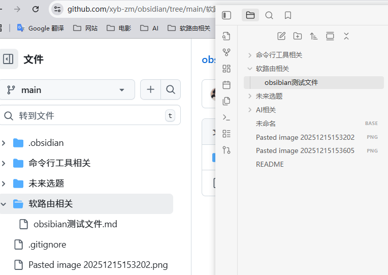

# 你好，Obsibain ,你是一个很好用的软件，
先看防弹咖啡SDK快递费经典复刻大富科技地方戴福卡多凡塑料袋开发 福
发多少看见对方 
==dkfkdkfjd==
# 一个#号+空格是一级标题
## 两个#号+空格是二级标题
### 3个#号+空格是三级标题，以此类推
**加粗**

~~四个~线包裹起来是删除~~
==四个=号包裹起来是高亮==
```java
	system.out.println(”123“)
```
>创建的引用
快递反馈方可开始卡多凡款式大方科技时代峰峻开始看到付件
款式大方拒收到付 开始减肥开始到付件上课的发奖金水电费
就开始地方绿色防控款式大方烧烤师傅

. 无序列表
. 无序列表
1. 有序列表
2. 有序列表
3. 有序列表
4. 有序列表
5. 有序列表

| 姓名  | 年龄  | 班级  | 分数  |
| --- | --- | --- | --- |
| 张三  | 12  | 2   | 95  |
| 李四  | 11  | 2   | 92  |
$$
1+2=3
3/5=
$$

你好
